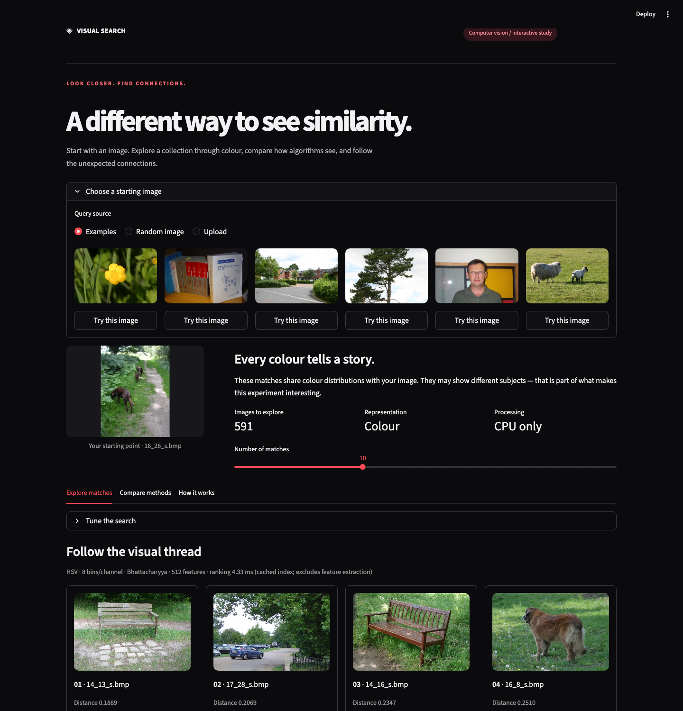
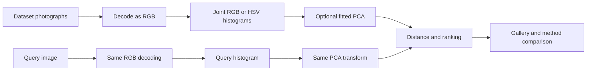

# Visual Search

**Start with an image. Follow the colour connections.**

An interactive computer vision portfolio project by **Victor Johnson**, developed from EEE3032 coursework at the University of Surrey. Explore the MSRC-v2 collection through colour, compare retrieval methods, and see where classical computer vision succeeds — and where it misses the meaning of an image.



Full desktop and mobile captures, plus suggested portfolio captions, are in [`stock-images/`](stock-images/README.md).

## Try the experience

- Choose one of six example images, try a random query, or upload your own photo.
- Follow a result with **Search from this image** without losing your method settings.
- Compare two independently configured methods; shared matches are labelled.
- Explore an interactive RGB distribution chart and an explanation of the pipeline.
- Adjust RGB/HSV, 4/8 bins per channel, PCA, six distance metrics, and 5–20 results.

The default is HSV, 8 bins per channel, no PCA, Bhattacharyya distance, and 10 results. Images uploaded by visitors remain in their Streamlit session; the app does not write them to disk or send them to an inference service.

## Local setup

Use **Python 3.12**. Run these commands from the repository root:

```bash
python3.12 -m venv .venv
source .venv/bin/activate
pip install -r requirements.txt
python src/utils/download_dataset.py
streamlit run src/streamlit-app.py
```

Open `http://localhost:8501`. Preparation downloads roughly 110 MB, validates all 591 photographs, excludes segmentation masks, and caches four histogram matrices. Preparation is idempotent; a complete local collection does not download again. If the upstream service is unavailable:

```bash
python src/utils/download_dataset.py --archive /path/to/msrc_objcategimagedatabase_v2.zip
```

The archive must retain its `Images/` folder. The downloader rejects unsafe paths, oversized archives, unreadable images, and incomplete collections before replacing existing photos. It does not download anything during app startup. An incomplete manually supplied collection can still be explored if it has at least two readable images, with a visible warning.

Convenience commands: `bash run_project.sh prepare`, `bash run_project.sh app`, and `bash run_project.sh notebook`. Set `PYTHON=python3.12` when creating an environment through the script. Notebook dependencies are in `requirements-notebooks.txt`; the old conda/pip exports and notebooks remain historical coursework artifacts, not deployment inputs.

## Docker on a VPS

Requires Docker Engine and Docker Compose v2. The image runs as UID 10001 and uses CPU-only libraries. No API key or paid service is needed. Start with approximately 2 GB RAM; measure your expected concurrency before raising traffic.

```bash
docker compose build
docker compose --profile setup run --rm prepare
docker compose up -d app
docker compose ps
curl -f http://127.0.0.1:8501/_stcore/health
```

The app binds to **127.0.0.1:8501**, ready for your reverse proxy. Dataset images and rebuildable feature caches live in the `visual-search-data` named volume. Restarts do not need network access. Avoid `docker compose down -v` unless you intend to delete that data.

For an offline archive on the VPS:

```bash
docker compose --profile setup run --rm \
  -v /absolute/path/to/msrc.zip:/input/msrc.zip:ro \
  prepare python src/utils/download_dataset.py --archive /input/msrc.zip
```

The health endpoint checks that Streamlit is serving; it does not prove dataset readiness. Confirm the gallery shows **591 images** after preparation. Logs: `docker compose logs --tail=100 app`. The app reports missing data with preparation instructions instead of repeatedly rerunning.

### Host-based Nginx

Use a dedicated hostname, such as `visual-search.example.com`, pointing at your VPS. Add the location block in [`deploy/nginx.conf`](deploy/nginx.conf) to your existing HTTPS server configuration and retain your certificate settings. It forwards to localhost:8501, supports WebSockets, and allows 10 MB image uploads with request overhead. Validate with `nginx -t` before reloading Nginx.

### Nginx Proxy Manager in Docker

Find the external Docker network already used by Nginx Proxy Manager and set its name:

```bash
export PROXY_NETWORK=your_existing_proxy_network
docker compose -f compose.yaml -f deploy/compose.npm.yaml up -d app
```

In Nginx Proxy Manager, create a Proxy Host:

| Setting | Value |
| --- | --- |
| Domain | Your dedicated hostname |
| Scheme | `http` |
| Forward hostname | `visual-search` |
| Forward port | `8501` |
| Websockets Support | Enabled |
| SSL | Request/select certificate; Force SSL |
| Advanced | `client_max_body_size 12m;` and `proxy_read_timeout 86400;` |

The provided override joins the existing proxy network with a stable alias. Both containers must be connected to that network. Use the same two Compose files for later up/down operations. No separate public port 8501 is needed. Streamlit's CORS/XSRF protections remain enabled.

### Automatic deployment with GitHub Actions

[`.github/workflows/deploy.yml`](.github/workflows/deploy.yml) deploys pushes to `main` and supports **Actions → Deploy to VPS → Run workflow** on `main`. It connects over SSH, fast-forwards the server checkout to the triggering commit, builds a commit-tagged image, prepares/reuses the dataset, and waits for Docker health before reporting success. Deployments run one at a time; stale queued commits are skipped.

One-time server setup (as your deployment user):

```bash
git clone --branch main https://github.com/Victor-Johnson/computer-vision-visual-search.git ~/computer-vision-visual-search
```

Install Docker Engine and Compose v2 with `up --wait` support. The deployment user must have Docker access without interactive sudo, permission to write the checkout, and access to fetch the Git remote. Keep the checkout on `main` with no tracked local edits. Configure Nginx using the instructions above.

In **GitHub → Settings → Secrets and variables → Actions**, configure:

| Type | Name | Value |
| --- | --- | --- |
| Secret | `VPS_HOST` | Server IP or hostname |
| Secret | `VPS_USER` | SSH deployment user |
| Secret | `VPS_SSH_KEY` | Private SSH key whose public key is authorized on the VPS |
| Secret | `VPS_HOST_FINGERPRINT` | SHA256 SSH host-key fingerprint, obtained from your trusted server console |
| Variable | `VPS_DEPLOY_PATH` | Optional absolute checkout path; defaults to `~/computer-vision-visual-search` on the server |
| Variable | `VPS_PORT` | Optional SSH port; defaults to `22` |
| Variable | `VPS_PROXY_NETWORK` | For Nginx Proxy Manager, its existing Docker network name; leave empty for host-based Nginx |

Get the host fingerprint from the VPS console with `ssh-keygen -lf /etc/ssh/ssh_host_ed25519_key.pub -E sha256` and copy the `SHA256:…` field. The workflow uses the [SSH action's fingerprint and environment-variable options](https://github.com/appleboy/ssh-action/tree/v1.2.0).

This app needs no AWS or OpenAI credentials and no generated `.env` file. The workflow retains tagged images for manual rollback and preserves the dataset volume. Build or preparation failures stop before replacing the app; a failed health check reports failure and logs but does not automatically roll back. To roll back, use the previous successful commit as `IMAGE_TAG` with the instructions below. Adding this workflow alone does not deploy until it is pushed to GitHub and the server/secrets are configured.

### Updates and rollback

Tag builds rather than overwriting a known-good deployment. Set `IMAGE_TAG` to a commit identifier (or release name):

```bash
export IMAGE_TAG=release-1
docker compose build
docker compose up -d --no-build app
```

For an update, check out the new revision, use a new tag, build, and run the same commands. Check health and perform a sample search. For rollback, check out the previous deployment configuration, set `IMAGE_TAG` to its retained image tag, and run `docker compose up -d --no-build app`. Keep the named volume. Re-run preparation only when repairing data; restart the app after changing its dataset so its in-memory catalog is refreshed.

## How retrieval works



All decoding produces RGB arrays, applies EXIF orientation, composites transparency on white, and limits processing to a 1024-pixel longest edge. The joint histogram has 64 or 512 dimensions and sums to one. Optional PCA fits on dataset features and retains at least 95% of variance. Dataset content fingerprints invalidate disk features when images change; the app caches fitted indexes in memory. Legacy `.pkl` artifacts are never loaded by the deployed app.

| Representation | Available distances |
| --- | --- |
| Normalized histograms | Bhattacharyya, Chi-Square, L1, L2, cosine, Mahalanobis |
| PCA features | L1, L2, cosine, Mahalanobis |

Chi-Square and Bhattacharyya require nonnegative histograms, so they cannot be selected for PCA features. Mahalanobis uses a covariance matrix regularized with `1e-6` on its diagonal. Equal distances sort by filename. Dataset queries exclude their own image; uploads have no dataset identity and may retrieve an identical dataset image.

Distances are **not confidence percentages** and are not comparable across methods. Displayed timing covers ranking only, after the index is ready. The colour chart shows separate channel distributions for interpretation, not the full joint retrieval descriptor.

Global histograms discard spatial arrangement and semantic meaning. Colour, lighting, and background can dominate results. This project demonstrates an interpretable classical baseline; it does not claim semantic AI search or newly verified benchmark accuracy. Existing notebook results and report figures are historical coursework.

## Development and verification

```bash
pip install -r requirements-dev.txt
python -m pytest -q
python -m playwright install chromium
# With the app running and the collection prepared:
python tests/browser_smoke.py
```

Tests cover numerical correctness, PCA transforms, metric restrictions, deterministic ranking, uploads, masks, cache rebuilding, safe archive handling, incomplete data, and Streamlit session interactions. The browser smoke script checks actual file uploads, desktop/mobile layouts, and captures the screenshots used here. Set `VISUAL_SEARCH_URL` to test a deployed hostname, including its reverse proxy.

Core implementation: `src/search/` handles image ingestion and retrieval; `src/streamlit-app.py` presents the experience; `src/utils/download_dataset.py` prepares data. The original BGR-based extractor is retained for notebook compatibility and is not used by the app.

The container follows [Streamlit's Docker deployment guidance](https://docs.streamlit.io/deploy/tutorials/docker). Real VPS DNS, certificates, and proxy routing must be validated on your server; local container checks cannot establish those.

## Dataset and credit

MSRC-v2 photographs and annotations are from Microsoft Research. The preparation command fetches the original Microsoft-hosted archive and uses its 591 photographs; the image collection is not committed to this repository. Follow the dataset provider's terms when using the source data. The screenshots show dataset samples solely to illustrate this project. Coursework notebooks, reports, and the original demo video are preserved in `notebooks/`, `report/`, and `demo/`.

### Optional local Nginx smoke test

```bash
docker compose -f compose.yaml -f deploy/compose.smoke.yaml up -d proxy-smoke
VISUAL_SEARCH_URL=http://127.0.0.1:18501 python tests/browser_smoke.py
docker compose -f compose.yaml -f deploy/compose.smoke.yaml stop proxy-smoke
```

This exercises the WebSocket session and image upload path through a real local Nginx container. It does not provision or test a public TLS certificate.
